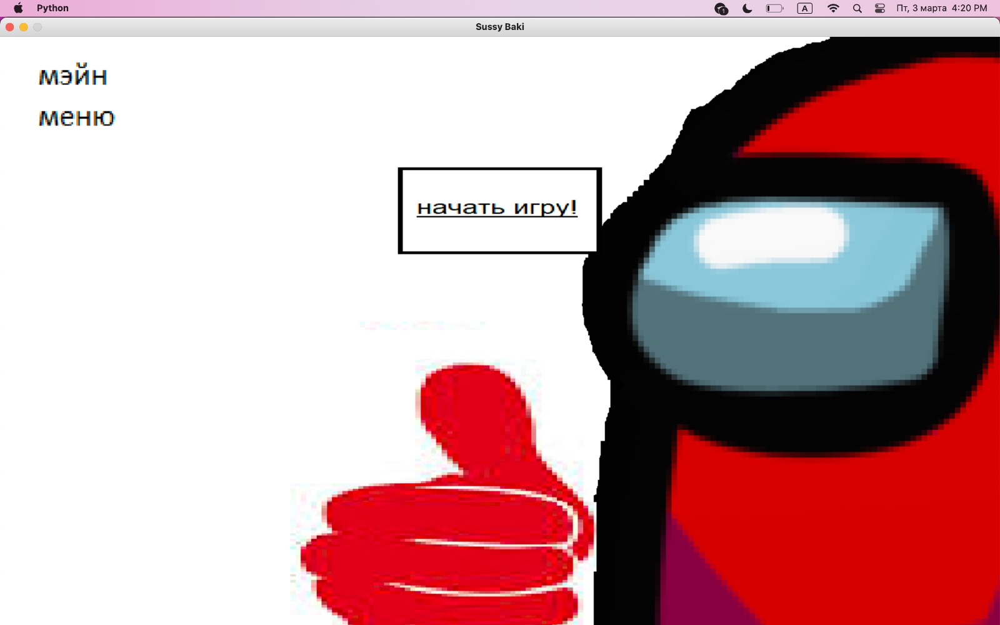
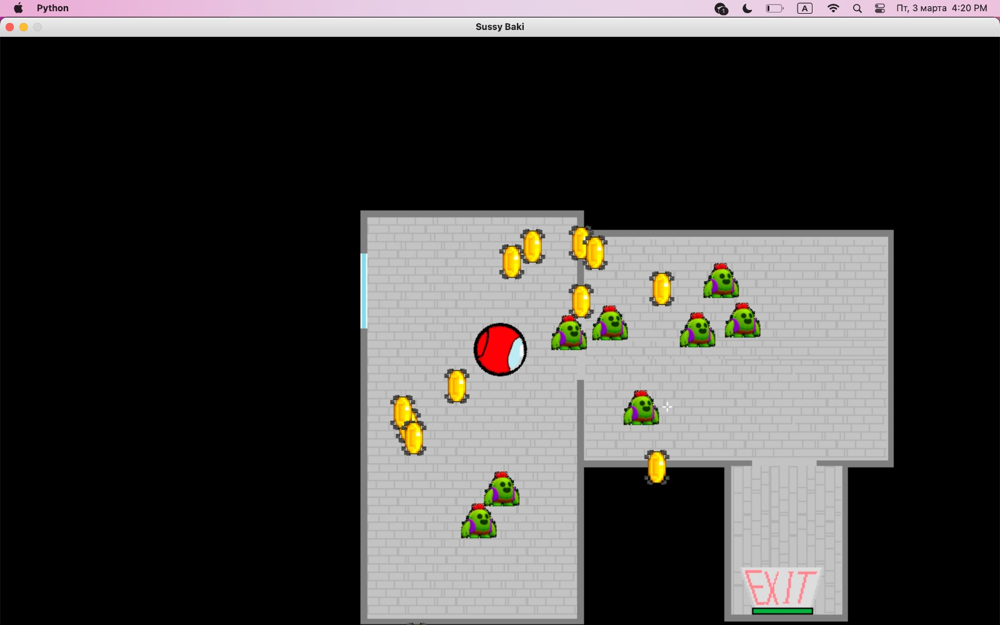
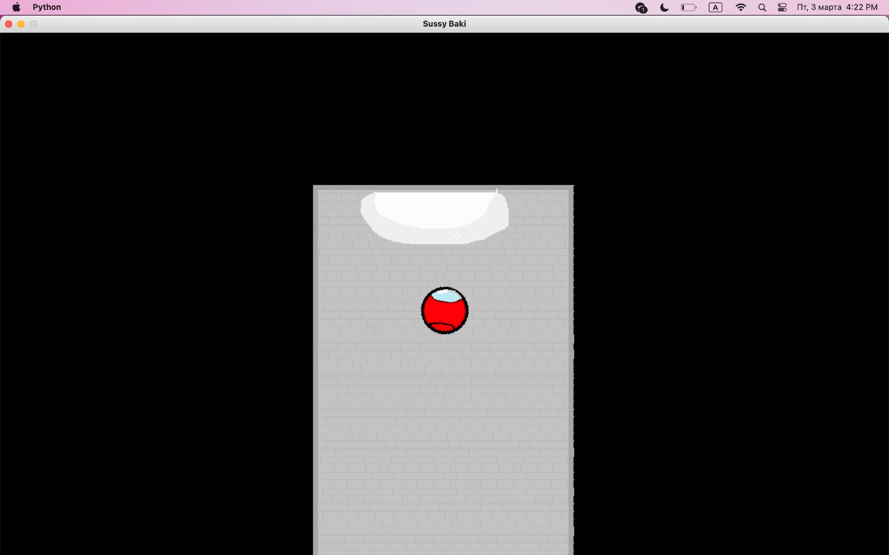
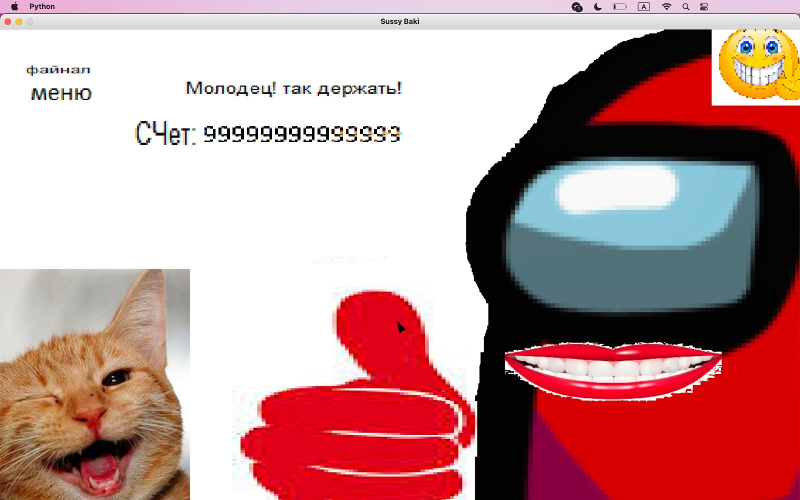

# Sussy Baki Game
## Игра на Pygame

Наша замечательная игра - это история об астронавте по имени Баки, который вследствие бухгалтерской ошибки Лупы и Пупы, вернувшись с орбитальной станции не имеет средств к сущестованию. В этой сложной ситуации он красит свой скафандр в красный цвет как символ борьбы с несправедливостью, и отправляется в опасное приключение в заброшенное здание, в котором космические пираты оставили свои сокровища, начинив здание ловушками. 

Цель игры - пробраться по двум этажам пиратского схрона, собрав максимальное количество монет, чтобы набрать максимальный счет. Финальный экран символизирует восстановление персонажем своего статуса.

Игра является по сути хардкорным Rogue like проектом, который мало кому будет возможно пройти с первого раза. В игре применяется система рекордов и их сохранения, что вносит соревновательный азарт и мотивирует к заучиванию уровней и совершенствованию тактик. Даже через много часов, проведенных за игрой, она способна удивлять новыми и новыми комбинациями монеток и шипов на уровнях.

Название игры означает, что во время своего приключения Баки вызывает подозрение у тех, кто мог его видеть, так как космонавт в красном костюме - зрелище редкое.

